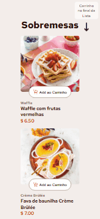

# Lista de produtos com carrinho 🛒

Projeto com uma lista de produtos que podem ser adicionados ao carrinho de compras que fica ao lado dessa lista. 

Esse projeto foi retirado do Frontend Mentor para colocar em prática minhas habilidades como desenvolvedor front-end.

## Tecnologias usadas 👨‍💻

- React 

- Styled Components 

- React Responsive 

- TypeScript 

## Prévia Desktop 💻

Veja uma pequena prévia do meu portfólio.


## Prévia Mobile 📱



Para ver mais detalhes, acesse o link do projeto hospedado no vercel fixado nos detalhes do repositório ou faça um clone do mesmo.

## Funcionalidades da aplicação 💡

A aplicação funciona da seguinte forma, a lista contem sobremesas com botões que pegam as informações e passam para o carrinho. Após clicar para adicionar a sobremesa, o botão muda de estado para que você possa ajustar a quantidade daquela sobremesa que você adicionou ao carrinho. No carrinho é renderizada a sobremesa adicionada com o nome, valor, quantidade, valor da sobremesa, vezes, a quantidade e um botão de remover do carrinho. A última parte do carrinho é valor total com uma nota ecológica e um botão de confirmar o pedido. Após clicar em confirmar pedido, seu pedido é finalizado e será mostrado um card com as sobremesas e o valor total com um botão de fazer um novo pedido que reinicia toda a aplicação.

## Bibliotecas utilizadas 📚

As bibliotecas que usei nesse projeto React foram o Styled Components e o React Responsive.

- Styled Components: essa biblioteca foi usada para adicionar estilos globais para o projeto, estilizar os componentes individualmente e para fazer uma animação com o keyframes.

- React Responsive: essa biblioteca eu usei especificamente para adicionar uma nota avisando que o carrinho está no final da lista quando o tamanho da tela atingir tamanhos menores.

## Decisões durante o processo 🤔

Durante a criação do projeto, me deparei com muitos estados e funções de componentes filhos que precisavam ser repassados para outros componentes filhos. Nisso, eu tive que colocá-los no componente pai para facilitar na reutilização desses dados. Até pensei em usar o ContextAPI, mas percebi que não seria tão útil já que o projeto não é tão grande para usar o mesmo.

## Passo a passo para clonar o projeto 📝

Para clonar o projeto, você pode usar o terminal de sua preferência, o passo a passo a seguir usa os comandos do gitbash como exemplo.

1 - Abra um terminal onde deseja colocar o projeto

2 - Clone o projeto
```
git clone "url do projeto"
```
3 - Acesse a pasta do projeto
```
cd projeto-lista-de-produtos-com-carrinho
```
4 - Instale as dependências do projeto
```
npm install
```
5 - Abra no vscode
```
cd .
```
6 -Execute o projeto
```
npm run dev
